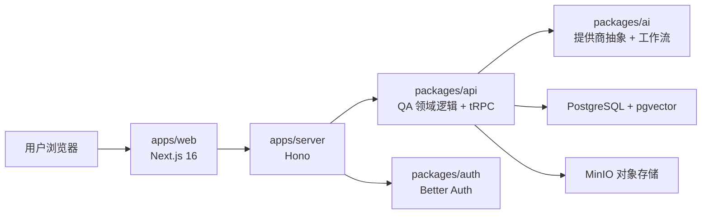

# 架构设计

## 1. 系统概览

Intelligent-QA-Assistant 是一个基于 Monorepo 的文档问答系统。用户通过 Better Auth 登录后，可以上传自己的私有文档，等待异步摄取完成，再通过聊天界面对自己的文档内容发起问答。

系统可以分为四个主要层次：

1. 表现层：`apps/web`
2. 传输层：`apps/server`
3. 领域与工作流层：`packages/api` 与 `packages/ai`
4. 持久化与基础设施层：`packages/db`、PostgreSQL 与 MinIO

## 2. 高层架构

## 3. Monorepo 模块职责

### `apps/web`

- 提供首页、认证入口、仪表盘、文档管理、聊天和模型设置页面
- 使用 `better-auth/react` 处理会话相关操作
- 使用 TanStack Query + tRPC Client 调用后端类型安全接口
- 仅在以下场景使用直接 HTTP 请求：
  - `POST /qa/documents/upload`
  - `POST /qa/chat/stream`

### `apps/server`

- 在端口 `3000` 上启动 Hono 服务
- 将 Better Auth 挂载到 `/api/auth/*`
- 将 tRPC 挂载到 `/trpc/*`
- 提供 QA 专用 HTTP 路由，用于文件上传和 SSE 流式回答
- 在非测试模式下每 5 秒轮询一次待处理的摄取任务

### `packages/api`

- 承担 QA 领域类型、仓储层、提示词组装、存储访问与 tRPC 路由定义
- 负责协调整个业务过程：
  - 文档上传
  - 摄取任务创建
  - 向量检索
  - 会话与消息持久化
  - 模型偏好管理
- 作为传输层与 AI 工作流、数据库之间的桥接层

### `packages/ai`

- 定义模型提供商抽象：
  - `ChatProvider`
  - `EmbeddingProvider`
  - `ModelRegistry`
- 实现 OpenAI 和 DeepSeek 的聊天模型适配
- 将 Embeddings 固定在 OpenAI
- 提供两个 Mastra 工作流：
  - 文档摄取工作流
  - 基于文档的问答工作流

### `packages/auth`

- 统一管理 Better Auth 服务端配置
- 通过 Drizzle Adapter 连接 PostgreSQL 中的认证表
- 配置可信来源和 Cookie 策略

### `packages/db`

- 定义 Drizzle Schema
- 暴露数据库客户端
- 提供 PostgreSQL + MinIO 的 Docker Compose 配置
- 包含 QA 相关表：
  - 文档
  - 文档分块
  - 摄取任务
  - 会话
  - 消息
  - 模型偏好

### `packages/env`

- 校验服务端和浏览器端环境变量
- 确保在配置缺失或格式错误时尽早失败

### `packages/ui`

- 提供共享的 shadcn/ui 基础组件和全局样式令牌

## 4. 核心运行流程

### 4.1 认证流程

1. Web 端通过 `NEXT_PUBLIC_SERVER_URL` 调用 Better Auth Client。
2. Hono 在 `/api/auth/*` 上挂载 Better Auth Handler。
3. Better Auth 通过 Drizzle 将用户和会话持久化到 PostgreSQL。
4. 受保护的 Next.js 页面通过 `verifyQaSession()` 在服务端校验当前登录态。
5. tRPC Context 会从请求头中解析当前会话信息。

### 4.2 文档上传与摄取流程

1. 用户在文档页面上传文件。
2. Web 端将 multipart form data 提交到 `POST /qa/documents/upload`。
3. Server 校验当前会话，并把文件交给 `saveUploadedDocuments()`。
4. `packages/api` 负责：
   - 校验文件类型
   - 将原始文件存入 MinIO
   - 写入 `qa_documents`
   - 写入 `qa_ingestion_jobs`
5. 后台轮询逻辑调用 `processPendingIngestionJobs()`。
6. 文档摄取工作流会执行：
   - 加载任务与文档上下文
   - 从 MinIO 读取文件
   - 从 TXT / MD / PDF / DOCX 中提取文本
   - 对文本进行分块
   - 通过 OpenAI 生成 Embeddings
   - 将向量分块写入 `qa_document_chunks`
   - 最终把文档状态更新为 `ready` 或 `failed`

### 4.3 基于文档的聊天流程

1. 用户打开已有会话或新建会话。
2. 用户输入问题，并可指定作用范围与回答长度。
3. Web 端会根据当前模型能力选择：
   - 调用 `POST /qa/chat/stream` 走 SSE 流式返回
   - 或退回到 `qa.chat.sendMessage` 的普通 tRPC Mutation
4. 后端处理过程如下：
   - 获取当前用户选中的模型
   - 使用 OpenAI 为问题生成查询向量
   - 在 pgvector 中检索最相关的文档分块
   - 组装 grounded prompt
   - 通过选中的聊天模型提供商生成答案
   - 持久化消息及引用来源

### 4.4 模型选择流程

1. 可选模型来自环境变量 `QA_ALLOWED_MODELS`。
2. 默认模型来自环境变量 `QA_DEFAULT_MODEL`。
3. `packages/ai` 中的 Registry 负责解析：
   - provider
   - model name
   - 配置状态
   - 能力信息
4. 用户模型偏好保存在 `qa_user_model_preferences`。
5. UI 通过 `qa.settings.getModels` 读取模型列表及当前选项。

## 5. 持久化模型

## 认证表

- Better Auth 相关表定义在 [`packages/db/src/schema/auth.ts`](/Users/heweicheng/Desktop/projects/Intelligent-QA-Assistant/packages/db/src/schema/auth.ts)。

## QA 表

- `qa_documents`：上传文档元数据与处理状态
- `qa_document_chunks`：文本分块与向量 Embeddings
- `qa_ingestion_jobs`：异步摄取任务状态
- `qa_conversations`：会话元数据
- `qa_messages`：用户消息与助手消息
- `qa_user_model_preferences`：用户当前选中的模型

## 对象存储

- 原始文件保存在 MinIO 中，Key 结构如下：
  - `user/{userId}/documents/{documentId}/{fileName}`

## 6. 当前架构特征

## 优点

- 应用与共享包职责边界清晰
- 前后端通过 tRPC 保持类型安全契约
- 聊天模型具备提供商抽象层，便于扩展
- 文档摄取与问答流程明确分离
- 数据天然按用户隔离

## 当前限制

- 即使聊天模型切换为其他提供商，Embeddings 仍固定使用 OpenAI
- 摄取任务依赖进程内轮询，不是独立 Worker 或队列系统
- 文件上传和流式聊天由于协议原因不走 tRPC
- 认证和 QA 流程都依赖正确的跨域 Cookie 配置

## 7. 默认服务端口

- Web：`http://localhost:3001`
- Server：`http://localhost:3000`
- PostgreSQL：`localhost:5432`
- MinIO API：`http://localhost:9000`
- MinIO Console：`http://localhost:9001`
